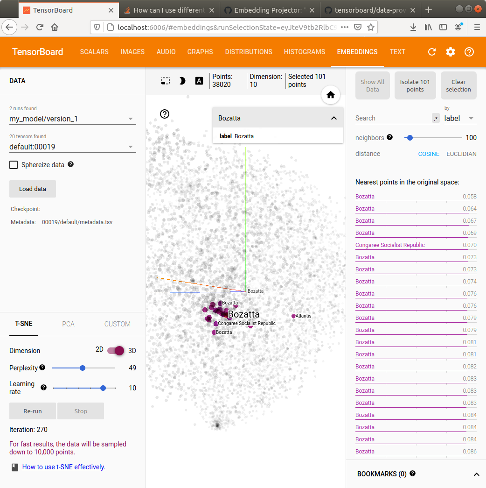
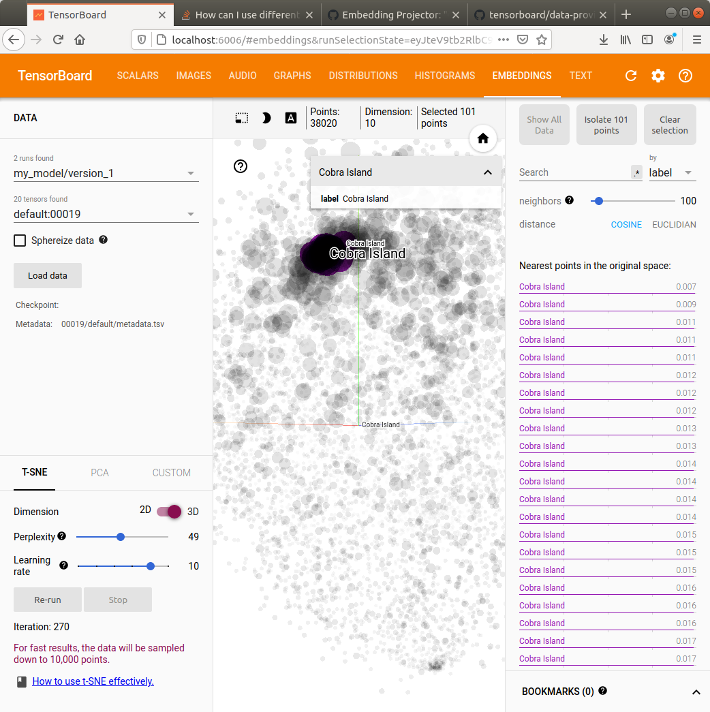

# booking-reco-challenge


### Intro 

This code aims at solving the 2020 booking challenge on next booking location prediction. [Challenge page](https://www.bookingchallenge.com)


### Architecture

The system learns in two steps : 

- Learn matric factorization embeddings for id like features : city_id, country_id
- Combine these feature learned in a fully connected neural net for a multi class classification problem.


### How to launch the code 

```
pip install -e . 
python -m reco_module
```

To check your results

```
 tensorboard serve --logdir \
    './tb_logs/sequence_model'
```


### Some results 

Embeddings learned with city_id co-occurences in trips




